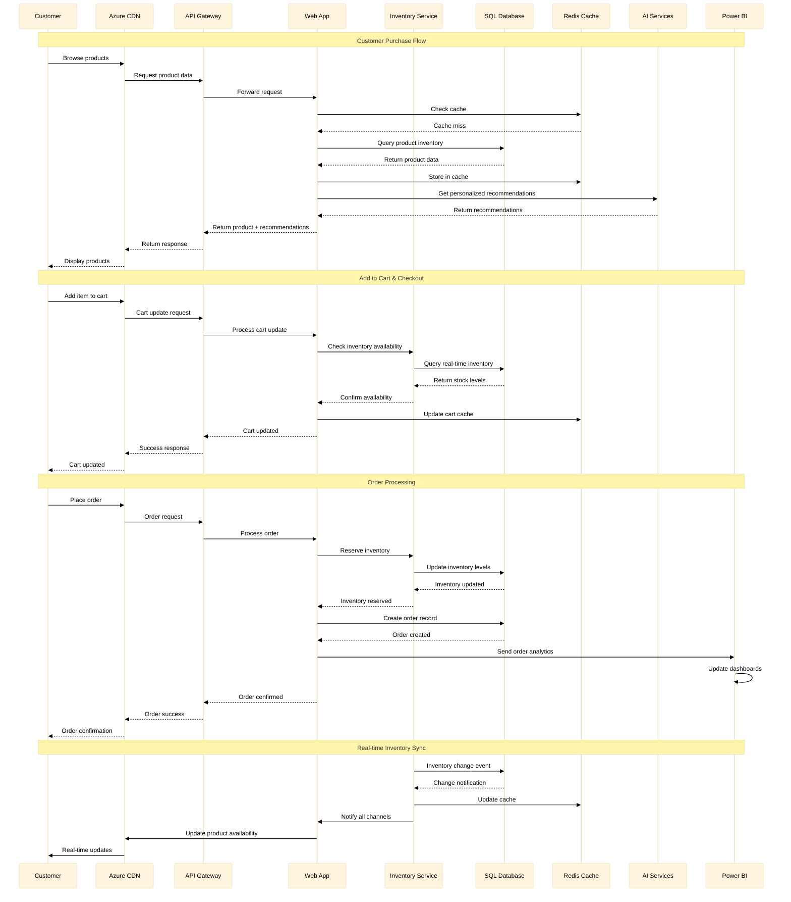
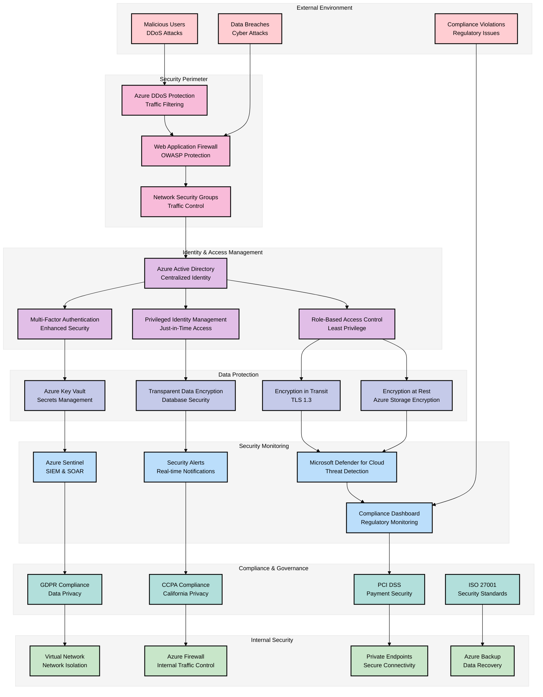

# Cloud Architecture Diagram
## FashionGroup Cloud Migration - Microsoft Azure

**Client:** FashionGroup  
**Industry:** Multinational Fashion Retail Conglomerate  
**Cloud Provider:** Microsoft Azure  
**Updated:** October 26, 2025

---

## Overview

This document provides visual representations of FashionGroup's cloud architecture using Microsoft Azure services. The diagrams illustrate how the various cloud components integrate to support omnichannel retail operations, real-time inventory management, and global scalability.

---

## 1. High-Level Architecture Overview

The following diagram shows the overall cloud architecture for FashionGroup's retail operations, demonstrating how different user touchpoints connect to Azure services through a multi-layered approach.

```mermaid
%%{init: {'theme':'base', 'themeVariables': {'primaryTextColor':'#000000', 'primaryColor':'#ffffff', 'fontSize':'14px', 'clusterBkg':'#f5f5f5'}}}%%
graph TB
    %% User Layer
    subgraph "User Interfaces"
        A1[Physical Stores<br/>1,000+ locations]
        A2[E-commerce Websites<br/>4 Brand Portals]
        A3[Mobile Applications<br/>iOS & Android]
        A4[Store Management<br/>POS Systems]
    end

    %% CDN and Edge
    subgraph "Content Delivery & Edge"
        B1[Azure CDN<br/>Global Distribution]
        B2[Edge Caching<br/>Performance Optimization]
    end

    %% API Gateway Layer
    subgraph "API Management"
        C1[Azure API Management<br/>Gateway & Security]
        C2[Rate Limiting<br/>& Throttling]
    end

    %% Core Azure Services
    subgraph "Microsoft Azure Cloud"
        %% IaaS Layer
        subgraph "Infrastructure as a Service (IaaS)"
            D1[Azure Virtual Machines<br/>B4ms, D-series, F-series]
            D2[Azure Virtual Network<br/>Hub-and-Spoke Topology]
            D3[Azure Storage<br/>Blob, Files, Archive]
        end

        %% PaaS Layer
        subgraph "Platform as a Service (PaaS)"
            E1[Azure App Service<br/>Web & API Apps]
            E2[Azure SQL Database<br/>Hyperscale Tier]
            E3[Azure Service Bus<br/>Message Queuing]
            E4[Azure Functions<br/>Serverless Processing]
        end

        %% SaaS Layer
        subgraph "Software as a Service (SaaS)"
            F1[Dynamics 365 Commerce<br/>Omnichannel Platform]
            F2[Azure AI Services<br/>Personalization & Analytics]
            F3[Power BI<br/>Business Intelligence]
        end

        %% Integration Services
        subgraph "Integration & Data Services"
            G1[Azure Data Factory<br/>ETL & Data Integration]
            G2[Azure Event Hubs<br/>Real-time Data Streaming]
            G3[Azure Cognitive Search<br/>Product Search & Discovery]
            G4[Azure Redis Cache<br/>High-Performance Caching]
        end
    end

    %% Security & Identity
    subgraph "Security & Identity"
        H1[Azure Active Directory<br/>Identity Management]
        H2[Microsoft Defender for Cloud<br/>Security Monitoring]
        H3[Azure Key Vault<br/>Secrets Management]
    end

    %% Monitoring & Management
    subgraph "Monitoring & Management"
        I1[Azure Monitor<br/>Performance Monitoring]
        I2[Application Insights<br/>Application Telemetry]
        I3[Azure Cost Management<br/>Cost Optimization]
    end

    %% Global Infrastructure
    subgraph "Global Infrastructure"
        J1[70+ Azure Regions<br/>Global Presence]
        J2[400+ Datacenters<br/>Worldwide Coverage]
        J3[Multi-Region Replication<br/>Disaster Recovery]
    end

    %% Connections
    A1 --> B1
    A2 --> B1
    A3 --> B1
    A4 --> C1

    B1 --> C1
    B2 --> C1

    C1 --> E1
    C1 --> F1

    E1 --> E2
    E1 --> E3
    E1 --> F1

    F1 --> G1
    F1 --> G2
    F1 --> F2

    G1 --> E2
    G2 --> E2
    G3 --> E2

    D1 --> D2
    D1 --> D3
    E1 --> D2
    E2 --> D2

    H1 --> C1
    H1 --> E1
    H1 --> F1

    I1 --> E1
    I1 --> E2
    I2 --> E1

    J1 --> D1
    J1 --> E1
    J2 --> D3
    J3 --> E2

    %% Styling
    classDef userLayer fill:#e1f5fe,stroke:#000000,stroke-width:2px,color:#000000
    classDef cdnLayer fill:#f3e5f5,stroke:#000000,stroke-width:2px,color:#000000
    classDef apiLayer fill:#e8f5e8,stroke:#000000,stroke-width:2px,color:#000000
    classDef iaasLayer fill:#fff3e0,stroke:#000000,stroke-width:2px,color:#000000
    classDef paasLayer fill:#e0f2f1,stroke:#000000,stroke-width:2px,color:#000000
    classDef saasLayer fill:#fce4ec,stroke:#000000,stroke-width:2px,color:#000000
    classDef integrationLayer fill:#f1f8e9,stroke:#000000,stroke-width:2px,color:#000000
    classDef securityLayer fill:#ffebee,stroke:#000000,stroke-width:2px,color:#000000
    classDef monitoringLayer fill:#e3f2fd,stroke:#000000,stroke-width:2px,color:#000000
    classDef globalLayer fill:#f9fbe7,stroke:#000000,stroke-width:2px,color:#000000

    class A1,A2,A3,A4 userLayer
    class B1,B2 cdnLayer
    class C1,C2 apiLayer
    class D1,D2,D3 iaasLayer
    class E1,E2,E3,E4 paasLayer
    class F1,F2,F3 saasLayer
    class G1,G2,G3,G4 integrationLayer
    class H1,H2,H3 securityLayer
    class I1,I2,I3 monitoringLayer
    class J1,J2,J3 globalLayer
```

### Architecture Overview Explanation

This high-level diagram illustrates FashionGroup's cloud architecture with the following key components:

#### **User Interface Layer**
- **Physical Stores**: 1,000+ retail locations with POS systems
- **E-commerce Platforms**: Four separate brand websites
- **Mobile Applications**: iOS and Android apps for each brand
- **Store Management**: Backend POS and inventory management systems

#### **Content Delivery & Edge Layer**
- **Azure CDN**: Global content distribution for fast website loading
- **Edge Caching**: Performance optimization for static content

#### **API Management Layer**
- **Azure API Management**: Centralized API gateway with security controls
- **Rate Limiting**: Protection against traffic spikes and abuse

#### **Azure Cloud Services (IaaS, PaaS, SaaS)**
- **IaaS**: Virtual machines, networking, and storage infrastructure
- **PaaS**: Application hosting, databases, and messaging services
- **SaaS**: Pre-built retail and analytics solutions

#### **Integration & Data Services**
- **Data Factory**: ETL processes for data integration
- **Event Hubs**: Real-time data streaming for inventory updates
- **Cognitive Search**: AI-powered product search and discovery
- **Redis Cache**: High-performance caching for improved response times

#### **Security & Compliance**
- **Azure Active Directory**: Centralized identity and access management
- **Microsoft Defender for Cloud**: Comprehensive security monitoring
- **Azure Key Vault**: Secure storage of secrets and certificates

#### **Global Infrastructure**
- **70+ Azure Regions**: Worldwide presence for low-latency access
- **400+ Datacenters**: Massive global infrastructure
- **Multi-Region Replication**: Disaster recovery and business continuity

---

## 2. Detailed Technical Architecture

The following diagram provides a more detailed view of how the Azure services integrate to support FashionGroup's specific retail operations.

```mermaid
%%{init: {'theme':'base', 'themeVariables': {'primaryTextColor':'#000000', 'primaryColor':'#ffffff', 'fontSize':'14px', 'clusterBkg':'#f5f5f5'}}}%%
graph TB
    %% External Users
    subgraph "External Users"
        U1[Customers<br/>Online Shopping]
        U2[Store Staff<br/>POS Operations]
        U3[Management<br/>Analytics & Reports]
        U4[Mobile Users<br/>App Experience]
    end

    %% Load Balancer & CDN
    subgraph "Traffic Management"
        LB[Azure Load Balancer<br/>Traffic Distribution]
        CDN[Azure CDN<br/>Global Content Delivery]
        WAF[Web Application Firewall<br/>Security Protection]
    end

    %% Application Layer
    subgraph "Application Layer"
        subgraph "E-commerce Applications"
            APP1[Premium Brand<br/>Web App]
            APP2[Fast Fashion<br/>Web App]
            APP3[Casual Wear<br/>Web App]
            APP4[Youth Fashion<br/>Web App]
        end
        
        subgraph "Mobile Backend"
            API1[Brand APIs<br/>REST Services]
            API2[Inventory API<br/>Real-time Updates]
            API3[Customer API<br/>Profile Management]
        end
    end

    %% Business Logic Layer
    subgraph "Business Logic & Integration"
        subgraph "Core Business Services"
            BL1[Inventory Management<br/>Service]
            BL2[Order Processing<br/>Service]
            BL3[Customer Management<br/>Service]
            BL4[Payment Processing<br/>Service]
        end
        
        subgraph "Integration Services"
            INT1[Azure Service Bus<br/>Message Queuing]
            INT2[Azure Event Grid<br/>Event Processing]
            INT3[Azure Logic Apps<br/>Workflow Automation]
        end
    end

    %% Data Layer
    subgraph "Data Layer"
        subgraph "Primary Databases"
            DB1[Azure SQL Database<br/>Customer & Orders]
            DB2[Azure SQL Database<br/>Inventory & Products]
            DB3[Azure SQL Database<br/>Analytics & Reporting]
        end
        
        subgraph "Data Storage"
            ST1[Azure Blob Storage<br/>Product Images]
            ST2[Azure Files<br/>Shared Documents]
            ST3[Azure Archive Storage<br/>Long-term Data]
        end
        
        subgraph "Caching & Search"
            CACHE[Azure Redis Cache<br/>Session & Data Cache]
            SEARCH[Azure Cognitive Search<br/>Product Search]
        end
    end

    %% AI & Analytics
    subgraph "AI & Analytics Services"
        subgraph "Azure AI Services"
            AI1[Computer Vision<br/>Product Recognition]
            AI2[Text Analytics<br/>Customer Feedback]
            AI3[Personalizer<br/>Recommendation Engine]
            AI4[Speech Services<br/>Voice Search]
        end
        
        subgraph "Analytics Platform"
            ANA1[Azure Synapse Analytics<br/>Data Warehouse]
            ANA2[Power BI<br/>Business Intelligence]
            ANA3[Azure Data Factory<br/>Data Pipeline]
        end
    end

    %% External Systems
    subgraph "External Systems"
        EXT1[Payment Gateways<br/>Stripe, PayPal]
        EXT2[Shipping Providers<br/>FedEx, UPS, DHL]
        EXT3[Social Media<br/>Marketing Integration]
        EXT4[Third-party APIs<br/>Weather, Events]
    end

    %% Security & Monitoring
    subgraph "Security & Monitoring"
        subgraph "Identity & Security"
            SEC1[Azure Active Directory<br/>Identity Provider]
            SEC2[Azure Key Vault<br/>Secrets Management]
            SEC3[Microsoft Defender<br/>Threat Protection]
        end
        
        subgraph "Monitoring & Management"
            MON1[Azure Monitor<br/>Infrastructure Monitoring]
            MON2[Application Insights<br/>Application Performance]
            MON3[Azure Cost Management<br/>Cost Optimization]
        end
    end

    %% Connections
    U1 --> CDN
    U2 --> LB
    U3 --> ANA2
    U4 --> API1

    CDN --> WAF
    LB --> WAF
    WAF --> APP1
    WAF --> APP2
    WAF --> APP3
    WAF --> APP4

    APP1 --> API1
    APP2 --> API1
    APP3 --> API1
    APP4 --> API1

    API1 --> BL1
    API2 --> BL1
    API3 --> BL3

    BL1 --> INT1
    BL2 --> INT1
    BL3 --> INT1
    BL4 --> INT1

    INT1 --> DB1
    INT1 --> DB2
    INT2 --> DB3

    BL1 --> CACHE
    BL2 --> CACHE
    BL3 --> CACHE

    DB1 --> ST1
    DB2 --> ST1
    DB3 --> ST2

    SEARCH --> DB2
    CACHE --> DB1

    AI1 --> ST1
    AI2 --> DB3
    AI3 --> DB1
    AI4 --> API1

    ANA3 --> DB1
    ANA3 --> DB2
    ANA3 --> DB3
    ANA1 --> ANA3
    ANA2 --> ANA1

    BL4 --> EXT1
    BL2 --> EXT2
    BL3 --> EXT3
    AI3 --> EXT4

    SEC1 --> API1
    SEC1 --> BL1
    SEC2 --> BL4
    SEC3 --> WAF

    MON1 --> APP1
    MON1 --> DB1
    MON2 --> API1
    MON3 --> BL1

    %% Styling
    classDef userStyle fill:#e3f2fd,stroke:#000000,stroke-width:2px,color:#000000
    classDef trafficStyle fill:#f3e5f5,stroke:#000000,stroke-width:2px,color:#000000
    classDef appStyle fill:#e8f5e8,stroke:#000000,stroke-width:2px,color:#000000
    classDef businessStyle fill:#fff3e0,stroke:#000000,stroke-width:2px,color:#000000
    classDef dataStyle fill:#e0f2f1,stroke:#000000,stroke-width:2px,color:#000000
    classDef aiStyle fill:#fce4ec,stroke:#000000,stroke-width:2px,color:#000000
    classDef externalStyle fill:#f1f8e9,stroke:#000000,stroke-width:2px,color:#000000
    classDef securityStyle fill:#ffebee,stroke:#000000,stroke-width:2px,color:#000000
    classDef monitoringStyle fill:#e1f5fe,stroke:#000000,stroke-width:2px,color:#000000

    class U1,U2,U3,U4 userStyle
    class LB,CDN,WAF trafficStyle
    class APP1,APP2,APP3,APP4,API1,API2,API3 appStyle
    class BL1,BL2,BL3,BL4,INT1,INT2,INT3 businessStyle
    class DB1,DB2,DB3,ST1,ST2,ST3,CACHE,SEARCH dataStyle
    class AI1,AI2,AI3,AI4,ANA1,ANA2,ANA3 aiStyle
    class EXT1,EXT2,EXT3,EXT4 externalStyle
    class SEC1,SEC2,SEC3 securityStyle
    class MON1,MON2,MON3 monitoringStyle
```

### Detailed Architecture Explanation

This detailed technical architecture shows the specific Azure services and their relationships:

#### **Traffic Management**
- **Azure Load Balancer**: Distributes traffic across multiple application instances
- **Azure CDN**: Caches static content globally for faster loading
- **Web Application Firewall**: Protects against common web attacks

#### **Application Layer**
- **Four Brand Web Apps**: Separate Azure App Service instances for each brand
- **Mobile Backend APIs**: RESTful services for mobile applications
- **Inventory API**: Real-time inventory updates across all channels

#### **Business Logic & Integration**
- **Core Business Services**: Microservices for inventory, orders, customers, and payments
- **Azure Service Bus**: Reliable message queuing between services
- **Azure Event Grid**: Event-driven architecture for real-time processing
- **Azure Logic Apps**: Workflow automation for business processes

#### **Data Layer**
- **Azure SQL Databases**: Separate databases for different data types
- **Azure Blob Storage**: Product images and media files
- **Azure Files**: Shared documents and configuration files
- **Azure Redis Cache**: High-performance caching for frequently accessed data
- **Azure Cognitive Search**: AI-powered product search capabilities

#### **AI & Analytics**
- **Azure AI Services**: Computer vision, text analytics, personalization, and speech
- **Azure Synapse Analytics**: Data warehouse for business intelligence
- **Power BI**: Self-service analytics and reporting
- **Azure Data Factory**: ETL processes for data integration

---

## 3. Data Flow Architecture

The following diagram illustrates how data flows through the system for key retail operations.

### Data Flow Explanation

This sequence diagram shows the complete data flow for a customer purchase:

#### **Product Browsing**
1. Customer requests products through CDN
2. System checks Redis cache first for performance
3. If cache miss, queries SQL Database
4. AI services provide personalized recommendations
5. Response cached for future requests

#### **Cart Management**
1. Customer adds items to cart
2. System checks real-time inventory availability
3. Cart data cached for performance
4. Inventory levels updated in real-time

#### **Order Processing**
1. Customer places order
2. System reserves inventory immediately
3. Order record created in database
4. Analytics data sent to Power BI
5. All channels notified of inventory changes

#### **Real-time Synchronization**
1. Inventory changes trigger events
2. Cache updated immediately
3. All channels (web, mobile, POS) notified
4. Customers see real-time availability

---

## 4. Security Architecture

The following diagram shows the security layers and compliance measures implemented across the FashionGroup cloud architecture.

### Security Architecture Explanation

This security architecture implements defense-in-depth principles:

#### **Security Perimeter**
- **Web Application Firewall**: Protects against OWASP Top 10 vulnerabilities
- **DDoS Protection**: Mitigates distributed denial-of-service attacks
- **Network Security Groups**: Controls traffic flow between resources

#### **Identity & Access Management**
- **Azure Active Directory**: Centralized identity provider
- **Multi-Factor Authentication**: Additional security layer
- **Role-Based Access Control**: Principle of least privilege
- **Privileged Identity Management**: Just-in-time access for admin tasks

#### **Data Protection**
- **Encryption at Rest**: All data encrypted using Azure-managed keys
- **Encryption in Transit**: TLS 1.3 for all communications
- **Azure Key Vault**: Secure storage of secrets and certificates
- **Transparent Data Encryption**: Database-level encryption

#### **Security Monitoring**
- **Microsoft Defender for Cloud**: Continuous threat detection
- **Azure Sentinel**: Security Information and Event Management (SIEM)
- **Real-time Alerts**: Immediate notification of security events
- **Compliance Dashboard**: Continuous compliance monitoring

#### **Compliance & Governance**
- **GDPR**: European data protection compliance
- **CCPA**: California consumer privacy compliance
- **PCI DSS**: Payment card industry security standards
- **ISO 27001**: International security management standards

---

## 5. Cost Optimization Architecture

The following diagram illustrates the cost optimization strategies implemented across the Azure architecture.

```mermaid
%%{init: {'theme':'base', 'themeVariables': {'primaryTextColor':'#000000', 'primaryColor':'#ffffff', 'fontSize':'14px', 'clusterBkg':'#f5f5f5'}}}%%
graph TB
    %% Cost Optimization Strategies
    subgraph "Cost Optimization Strategies"
        subgraph "Compute Optimization"
            CO1[Reserved Instances<br/>Up to 72% savings]
            CO2[Spot VMs<br/>Up to 90% savings]
            CO3[Auto-scaling<br/>Right-size resources]
            CO4[Azure Hybrid Benefit<br/>License optimization]
        end
        
        subgraph "Storage Optimization"
            SO1[Storage Tiers<br/>Hot/Cool/Archive]
            SO2[Lifecycle Management<br/>Automatic tiering]
            SO3[Compression<br/>Reduce storage costs]
            SO4[Cleanup Policies<br/>Remove unused data]
        end
        
        subgraph "Database Optimization"
            DO1[Elastic Pools<br/>Resource sharing]
            DO2[Serverless Tier<br/>Pay per use]
            DO3[Query Optimization<br/>Reduce compute]
            DO4[Index Management<br/>Improve performance]
        end
        
        subgraph "Network Optimization"
            NO1[CDN Caching<br/>Reduce bandwidth]
            NO2[Traffic Manager<br/>Route optimization]
            NO3[Private Endpoints<br/>Reduce data transfer]
            NO4[Compression<br/>Reduce data size]
        end
    end

    %% Monitoring & Management
    subgraph "Cost Monitoring & Management"
        subgraph "Cost Analysis"
            CA1[Azure Cost Management<br/>Spend tracking]
            CA2[Cost Alerts<br/>Budget notifications]
            CA3[Cost Allocation<br/>Department billing]
            CA4[ROI Analysis<br/>Value measurement]
        end
        
        subgraph "Automation"
            AUTO1[Azure Policy<br/>Cost governance]
            AUTO2[Azure Automation<br/>Scheduled tasks]
            AUTO3[PowerShell Scripts<br/>Resource management]
            AUTO4[ARM Templates<br/>Infrastructure as Code]
        end
    end

    %% Business Impact
    subgraph "Business Impact"
        subgraph "Operational Efficiency"
            OE1[Reduced Manual Work<br/>Automation savings]
            OE2[Faster Deployment<br/>Time to market]
            OE3[Improved Performance<br/>Customer satisfaction]
            OE4[Better Reliability<br/>Reduced downtime]
        end
        
        subgraph "Financial Benefits"
            FB1[35% Cost Reduction<br/>3-year projection]
            FB2[Pay-per-use Model<br/>No over-provisioning]
            FB3[Predictable Costs<br/>Better budgeting]
            FB4[ROI Achievement<br/>Value realization]
        end
    end

    %% Connections
    CO1 --> CA1
    CO2 --> CA1
    CO3 --> CA2
    CO4 --> CA3

    SO1 --> CA1
    SO2 --> CA2
    SO3 --> CA3
    SO4 --> CA4

    DO1 --> CA1
    DO2 --> CA2
    DO3 --> CA3
    DO4 --> CA4

    NO1 --> CA1
    NO2 --> CA2
    NO3 --> CA3
    NO4 --> CA4

    CA1 --> AUTO1
    CA2 --> AUTO2
    CA3 --> AUTO3
    CA4 --> AUTO4

    AUTO1 --> OE1
    AUTO2 --> OE2
    AUTO3 --> OE3
    AUTO4 --> OE4

    OE1 --> FB1
    OE2 --> FB2
    OE3 --> FB3
    OE4 --> FB4

    %% Styling
    classDef computeStyle fill:#e8f5e8,stroke:#000000,stroke-width:2px,color:#000000
    classDef storageStyle fill:#e3f2fd,stroke:#000000,stroke-width:2px,color:#000000
    classDef databaseStyle fill:#fff3e0,stroke:#000000,stroke-width:2px,color:#000000
    classDef networkStyle fill:#f3e5f5,stroke:#000000,stroke-width:2px,color:#000000
    classDef costStyle fill:#ffebee,stroke:#000000,stroke-width:2px,color:#000000
    classDef autoStyle fill:#e0f2f1,stroke:#000000,stroke-width:2px,color:#000000
    classDef opsStyle fill:#fce4ec,stroke:#000000,stroke-width:2px,color:#000000
    classDef financeStyle fill:#f1f8e9,stroke:#000000,stroke-width:2px,color:#000000

    class CO1,CO2,CO3,CO4 computeStyle
    class SO1,SO2,SO3,SO4 storageStyle
    class DO1,DO2,DO3,DO4 databaseStyle
    class NO1,NO2,NO3,NO4 networkStyle
    class CA1,CA2,CA3,CA4 costStyle
    class AUTO1,AUTO2,AUTO3,AUTO4 autoStyle
    class OE1,OE2,OE3,OE4 opsStyle
    class FB1,FB2,FB3,FB4 financeStyle
```

### Cost Optimization Explanation

This cost optimization architecture implements multiple strategies:

#### **Compute Optimization**
- **Reserved Instances**: 1-3 year commitments for up to 72% savings
- **Spot VMs**: Use unused capacity for up to 90% savings on flexible workloads
- **Auto-scaling**: Automatically adjust resources based on demand
- **Azure Hybrid Benefit**: Use existing Windows Server licenses for additional savings

#### **Storage Optimization**
- **Storage Tiers**: Hot, Cool, and Archive tiers based on access patterns
- **Lifecycle Management**: Automatic movement between tiers
- **Compression**: Reduce storage costs through data compression
- **Cleanup Policies**: Remove unused and temporary data

#### **Database Optimization**
- **Elastic Pools**: Share resources across multiple databases
- **Serverless Tier**: Pay only for actual usage
- **Query Optimization**: Reduce compute requirements
- **Index Management**: Improve performance and reduce costs

#### **Network Optimization**
- **CDN Caching**: Reduce bandwidth costs and improve performance
- **Traffic Manager**: Optimize routing and reduce latency
- **Private Endpoints**: Reduce data transfer costs
- **Compression**: Minimize data transfer sizes

#### **Cost Monitoring & Management**
- **Azure Cost Management**: Track spending across all resources
- **Cost Alerts**: Notify when budgets are exceeded
- **Cost Allocation**: Bill departments for their cloud usage
- **ROI Analysis**: Measure value and return on investment

---

## Architecture Justification

### **Scalability Design**
The architecture is designed to handle FashionGroup's growth from 1,000+ stores to potentially 2,000+ stores globally. The use of Azure App Service with auto-scaling ensures that the system can handle traffic spikes during peak seasons and promotional events.

### **Security & Compliance**
The multi-layered security approach ensures compliance with GDPR, CCPA, and other regional regulations while protecting customer data and business operations. The use of Azure Active Directory and Microsoft Defender for Cloud provides enterprise-grade security.

### **Cost Optimization**
The architecture implements multiple cost optimization strategies that are projected to reduce IT infrastructure costs by 35% over 3 years while improving performance and reliability.

### **Global Reach**
With Azure's 70+ regions and 400+ datacenters, the architecture supports FashionGroup's global operations with low-latency access for customers and staff worldwide.

### **Integration Benefits**
The native integration with Microsoft's ecosystem (Office 365, Teams, Dynamics 365) provides significant productivity benefits and reduces integration complexity compared to multi-vendor solutions.

---

*This architecture diagram is based on the cloud services and strategies outlined in the FashionGroup Project Proposal, updated as of October 26, 2025.*
